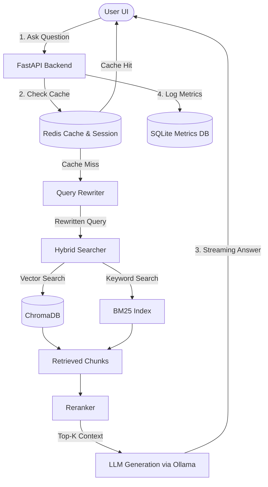

# Local RAG LLM System (Ollama + ChromaDB)

A local Retrieval-Augmented Generation (RAG) system. This application allows users to ingest text or document sources, ask questions, and receive streaming answers fully grounded in their documents, all running locally on their machine.

---

## Table of Contents
- [Project Overview](#project-overview)
- [Key Features](#key-features)
- [Architecture & Design](#architecture--design)
- [Project File Structure](#project-file-structure)
- [Prerequisites & Installation](#prerequisites--installation)
  - [1. Ollama (LLM & Embeddings)](#1-ollama-llm--embeddings)
  - [2. Redis Server](#2-redis-server)
  - [3. Backend Setup (Python & Conda)](#3-backend-setup-python--conda)
  - [4. Frontend Setup (React & Vite)](#4-frontend-setup-react--vite)
- [Running the Application](#running-the-application)
  - [Quick Start (Recommended)](#quick-start-recommended)
  - [Manual Execution](#manual-execution)
- [Configuration Reference](#configuration-reference)
- [API Endpoints](#api-endpoints)
- [Project Phases & Roadmap](#project-phases--roadmap)

---

## Project Overview

This project is a localized RAG system designed for privacy, speed, and customization. It leverages local large language models (LLMs) and local embedding models to run complex Q&A pipelines without sending any data to third-party cloud providers.

### Tech Stack:
* **Backend**: FastAPI (Python) for API endpoints, routing, rate limiting, and ingestion tasks.
* **Frontend**: React (Vite) + CSS for a premium, responsive Chat UI and Observability/Metrics Dashboard.
* **Vector Database**: ChromaDB for embedding storage and semantic document search.
* **LLM & Embeddings Provider**: Ollama (running models locally).
* **Caching & Session Memory**: Redis for rate limiting, semantic caching of queries, and multi-turn chat session memory.

---

## Key Features

1. **Document Ingestion**: Supports pasting raw text or uploading documents (like `.txt`, `.pdf`), chunking them, and generating embeddings.
2. **Contextual Ingestion**: Employs contextual chunking to preserve local context within documents during ingestion.
3. **Advanced Retrieval Pipeline**:
   * **Hybrid Search**: Combines ChromaDB dense vector search with BM25 sparse keyword search.
   * **Query Rewriting**: Refines user queries using the local LLM to improve search accuracy.
   * **Reranking**: Scores and filters retrieved chunks using a SentenceTransformer reranker before passing them to the generator.
4. **Caching & Session Memory**:
   * **Semantic Caching**: Automatically caches semantically similar queries using Redis to avoid redundant LLM invocations and speed up response times.
   * **Rate Limiting**: Custom token-bucket rate limiting built on Redis to prevent API abuse.
   * **Redis Memory**: Remembers prior turns in the conversation while active.
5. **Observability & Analytics**:
   * **Metrics DB**: Tracks query latency, token usage, retrieval relevance scores, and user thumbs up/down feedback.
   * **Frontend Metrics Dashboard**: Allows monitoring system performance, token counts, and hit rates in real-time.

---

## Architecture & Design



---

## Project File Structure

Below is the directory tree of the workspace, showing where each component and logic block resides:

```
RAG-LLM-Ollama/
├── backend/                       # FastAPI Backend codebase
│   ├── cache/
│   │   └── semantic_cache.py      # Redis-based semantic cache for queries
│   ├── ingestion/
│   │   ├── chunker.py             # Document chunking algorithms
│   │   ├── contextualizer.py      # LLM contextualization of chunks
│   │   └── reingest.py            # Script/logic for database reingestion
│   ├── observability/
│   │   ├── logger.py              # Application logger configuration
│   │   └── metrics_db.py          # SQLite database storing latency/token usage/metrics
│   ├── retrieval/
│   │   ├── bm25_index.py          # BM25 sparse retrieval setup
│   │   ├── hybrid_search.py       # Dense (vector) + Sparse (BM25) fusion
│   │   ├── query_rewrite.py       # Rephrase questions for better retrieval
│   │   └── reranker.py            # SentenceTransformer-based chunk reranking
│   ├── config.py                  # Pydantic-based configuration loading envs
│   ├── main.py                    # API router, CORS setup, and endpoints definition
│   ├── prompt_templates.py        # Prompts for LLM and Rerankers
│   ├── rag.py                     # Execution engine tying ingestion, retrieval & generation together
│   ├── rate_limit.py              # Redis token-bucket rate limiter
│   ├── redis_store.py             # Redis store wrapper (session states, prompt cache)
│   └── self_check.py              # Simple script to verify Redis & Ollama connections
│
├── frontend/                      # React Frontend codebase (Vite-based)
│   ├── public/                    # Static assets
│   ├── src/
│   │   ├── __tests__/             # Frontend component test files
│   │   ├── assets/                # Local styling assets & fonts
│   │   ├── pages/
│   │   │   └── MetricsDashboard.jsx # UI view showing analytics and dashboard
│   │   ├── api.js                 # API endpoints fetching functions
│   │   ├── App.css                # Global and component-specific styling
│   │   ├── App.jsx                # Main workspace, chat layout & logic
│   │   ├── index.css              # Main CSS layout directives
│   │   └── main.jsx               # Entrypoint for React app
│   ├── package.json               # Node.js dependencies
│   ├── vite.config.js             # Vite configurations
│   └── vitest.config.js           # Vitest configurations
│
├── tests/                         # Backend Unit and Integration Tests
│   ├── conftest.py                # Pytest setups & fixtures
│   ├── test_chat_history.py
│   ├── test_config.py
│   ├── test_contextualizer.py
│   ├── test_frontend.py
│   ├── test_main.py
│   ├── test_observability.py
│   ├── test_rag.py
│   ├── test_redis_store.py
│   └── test_semantic_cache.py
│
├── data/                          # DB/Data directory (Ignored by Git)
│   ├── chroma/                    # ChromaDB local vectors database
│   ├── chat_history.json          # Persisted chat logs
│   ├── system_prompt.txt          # Persisted LLM system prompt
│   └── metrics.db                 # SQLite database for observability
│
├── start-app.bat                  # Single-click launcher (Windows Batch)
├── start-app.ps1                  # Single-click launcher (PowerShell)
├── stop-app.bat                   # Single-click shutdown (Windows Batch)
├── stop-app.ps1                   # Single-click shutdown (PowerShell)
├── requirements.txt               # Backend Python dependencies
├── STARTUP.md                     # Basic startup guide
└── README.md                      # Overall project documentation and report
```

---

## Prerequisites & Installation

To run this application locally, you will need to install and configure several dependencies on your machine.

### 1. Ollama (LLM & Embeddings)
Ollama runs LLMs locally.
1. Download Ollama from [https://ollama.com](https://ollama.com) and install it.
2. Launch Ollama in your system tray.
3. Open a terminal and pull the models specified in the config:
   ```powershell
   # Embedding model
   ollama pull nomic-embed-text

   # Small, fast local LLM (change config to use others if desired)
   ollama pull qwen2.5:0.5b
   ```

### 2. Redis Server
Redis handles semantic caching, rate limiting, and chat session state.
* **Windows (via Winget)**:
  ```powershell
  winget install Redis.Redis
  ```
* **Verify Redis**:
  Once installed, ensure the Redis service is running on default port `6379`. Test connection using:
  ```powershell
  redis-cli ping
  # Expected response: PONG
  ```

### 3. Backend Setup (Python & Conda)
It is recommended to use Anaconda or Miniconda to manage Python packages.
1. Open your terminal and create a dedicated conda environment:
   ```powershell
   conda create -n RAG python=3.10 -y
   ```
2. Activate the environment:
   ```powershell
   conda activate RAG
   ```
3. Install backend dependencies from the root directory:
   ```powershell
   pip install -r requirements.txt
   ```

### 4. Frontend Setup (React & Vite)
You will need Node.js installed to build and run the frontend.
1. Download and install Node.js (version 18+) from [https://nodejs.org](https://nodejs.org).
2. Navigate to the `frontend` directory:
   ```powershell
   cd frontend
   ```
3. Install frontend dependencies:
   ```powershell
   npm install
   ```

---

## Running the Application

### Quick Start (Recommended)
You can launch the entire stack (Redis, Backend, Frontend, and Browser UI) simultaneously:

* **Windows Double-Click**: Double-click [start-app.bat](./start-app.bat) in the root folder.
* **PowerShell Terminal**:
  ```powershell
  .\start-app.ps1
  ```
* **To stop the app stack**:
  Run `.\stop-app.ps1` or double-click [stop-app.bat](./stop-app.bat).

---

### Manual Execution
If you prefer running services in separate terminal windows, follow these steps:

#### Step 1: Start Redis
```powershell
redis-server
```

#### Step 2: Start Backend
```powershell
conda activate RAG
cd backend
uvicorn main:app --reload --port 8000
```
*Backend API docs will be active at [http://localhost:8000/docs](http://localhost:8000/docs).*

#### Step 3: Start Frontend
```powershell
cd frontend
npm run dev
```
*The Web UI will be running at [http://localhost:5173](http://localhost:5173).*

---

## Configuration Reference

The application behavior can be customized by setting environment variables in a `.env` file (saved in the root folder).

| Variable | Default Value | Description |
|----------|---------------|-------------|
| `OLLAMA_BASE` | `http://localhost:11434` | The host address for the local Ollama API |
| `EMBED_MODEL` | `nomic-embed-text` | Embedding model to encode document chunks |
| `LLM_MODEL` | `qwen2.5:0.5b` | LLM used for rewriting query and generation |
| `CHUNK_SIZE` | `500` | Token/character size of ingested document chunks |
| `CHUNK_OVERLAP`| `50` | Overlap size between adjacent document chunks |
| `TOP_K` | `4` | Number of context chunks retrieved for generation |
| `REDIS_URL` | `redis://localhost:6379/0` | Connection string for Redis |
| `SESSION_TTL` | `86400` (1 day) | How long a chat session remains cached in Redis |
| `PROMPT_CACHE_TTL`| `3600` (1 hour) | Lifespan of semantic cache objects |
| `MODEL_TIER` | `auto` | `auto\|small\|medium\|large`. `auto` picks by RAM: <10 GB small, 10–20 GB medium, >20 GB large |
| `REWRITE_MODEL` | *(empty)* | Model for query rewriting. Empty means use the tier's choice |
| `EXTRACT_MODEL` | *(empty)* | Model for entity extraction. Empty means use the tier's choice |
| `OLLAMA_KEEP_ALIVE` | `10m` | How long Ollama keeps models resident, avoiding reloads between requests |
| `RAG_DATA_DIR` | *(unset)* | Overrides the `data/` directory. Used by the eval harness to isolate its runs |

If a tier's model is not pulled in Ollama, the app logs a warning and falls back to
`LLM_MODEL`, so it keeps working on a machine that only has the small model.
`GET /api/health` reports the active `tier`, `ram_gb`, resolved `models`, and any
`missing_models` you can `ollama pull`.

---

## API Endpoints

The backend exposes the following endpoints (documented interactively at `/docs`):

| Method | Path | Description |
|--------|------|-------------|
| **GET** | `/api/health` | Checks status of Ollama, Redis, and DB configurations. |
| **GET/PUT** | `/api/settings/system-prompt` | Read or update the current system instruction prompt. |
| **POST** | `/api/chats/start` | Creates a new chat session in Redis. |
| **POST** | `/api/chats/ask` | Post a question `{question, session_id}` to generate a RAG response. |
| **POST** | `/api/chats/end` | Persists conversation history to disk and closes session. |
| **GET** | `/api/chats/history` | Fetches a list of all archived chats. |
| **GET/DELETE**| `/api/chats/history/{id}` | Retrieve or delete a specific archived chat session. |
| **GET** | `/api/sources` | Lists all documents uploaded to ChromaDB. |
| **POST** | `/api/sources` | Manually ingest text snippet `{name, text}`. |
| **POST** | `/api/sources/upload` | Upload `.txt` or `.pdf` file to ingest into ChromaDB. |
| **DELETE** | `/api/sources/{id}` | Remove a document source and its embeddings from the DB. |

---

## Project Phases & Roadmap

| Phase | Status | Scope |
|-------|--------|-------|
| **Phase 1** | Completed | Document upload/paste, text chunking, vector embedding, basic RAG, and query answering. |
| **Phase 2** | Completed | PDF/Markdown parsing, smart chunking, context preservation, and streaming LLM answers. |
| **Phase 3** | Completed | Custom system prompt editing, Redis session memory, prompt semantic caching, and chat log persistence. |
| **Phase 4** | Planned | Highlighting matched document chunks in the UI and source document text preview. |
| **Phase 5** | Planned | Configuration panel in UI for dynamic chunk size, LLM model choice, and custom parameters. |
