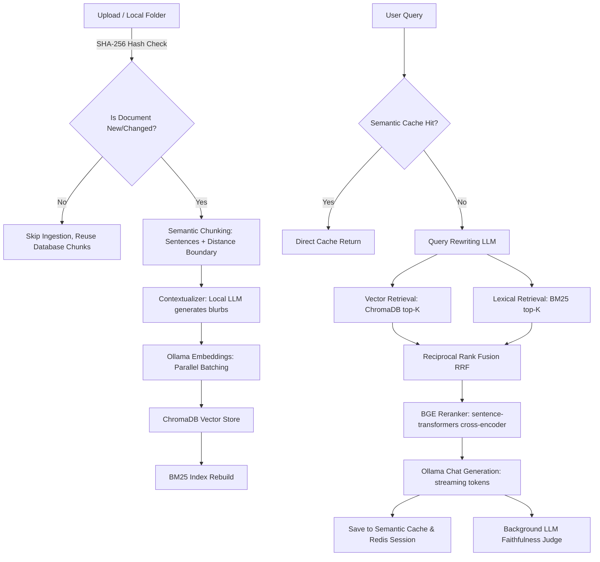

# RAG App Backend Architecture & Bottleneck Analysis

This document provides a detailed breakdown of the local RAG (Retrieval-Augmented Generation) backend components, files, data flows, and performance characteristics to assist in evaluation and bottleneck tracking.

---

## 1. Core Component Breakdown

The RAG application consists of four distinct layers: Ingestion, Retrieval & Reranking, Generation & LLM Orchestration, and Observability & Semantic Cache.

### A. Ingestion & Document Processing
* **Hash-Based Ingestion Cache:** Before any chunking or embedding occurs, a SHA-256 hash of the document content is computed. The backend queries ChromaDB for any existing chunks corresponding to the document name. If the hash matches the metadata (`doc_hash`) of existing chunks, the entire ingestion pipeline is bypassed, representing a **one-time ingestion cost** per document version.
* **Semantic Chunking:** Documents are split using a semantic split algorithm:
  1. The text is parsed into individual sentences using a regex boundary separator.
  2. Embeddings are generated in parallel using a Python `ThreadPoolExecutor` (issuing 8 concurrent requests to the Ollama embedding model endpoint) to eliminate sequential API request overhead.
  3. Cosine distances between consecutive sentence embeddings are calculated.
  4. Split boundaries are placed at points where the distance exceeds a statistical threshold: `mean_distance + 1.2 * std_distance`.
  5. Any resulting chunk exceeding the configured `CHUNK_SIZE` limit is recursively split into sub-chunks using character-based boundaries as a guard.
* **Contextual Blurb Enrichment:** For every chunk, a background summarizer prompts the local LLM to generate a short context blurb (document summary). This blurb is prepended to the chunk text before final database embedding, which helps preserve document-level context inside localized chunks.
* **Storage:** Vector embeddings (generated using `nomic-embed-text` or similar) are stored in a persistent ChromaDB database alongside text content and metadata (e.g. `doc_hash`, `source_name`, `page_number`, `topic`, `context_blurb`).

### B. Retrieval & Reranking Engine
* **Lexical Search (BM25):** The document collection is indexed inside a BM25 lexical search index using tokenized representations. This index is serialized and stored locally on file write.
* **Dense Vector Search:** Chunks matching the user query vector (or expanded query vectors) are retrieved from ChromaDB.
* **RRF Rank Fusion:** The rankings of BM25 and vector search are merged using Reciprocal Rank Fusion (RRF) with a default smoothing constant $K = 60$.
* **BGE Reranker:** RRF produces a merged pool of top-$K$ candidates (default 20). This candidate list is sent to a local cross-encoder model (`BAAI/bge-reranker-base` from the `sentence-transformers` library) which scores the semantic relevance between the query and each chunk content.
* **Output Trimming:** The reranked list is trimmed to keep only the highest scoring chunks, matching the target size of 5–10 chunks (default 8).

### C. Chat Generation & Session Control
* **Redis Store:** Chat session history, prompt keys, and cached RAG parameters are managed inside a Redis key-value instance.
* **Token Streaming:** The contextualized prompt is passed to the local LLM (default `qwen2.5:0.5b` or equivalent) running on Ollama. Generated tokens are streamed via Server-Sent Events (SSE) back to the client.
* **Inline Citation Extraction & Confidence:** After completion, citations are mapped to context chunks referenced inline (e.g. `[1]`, `[2]`), and a confidence score is calculated based on the rerank scores or vector similarities of the cited chunks.
* **Semantic Cache:** A Redis-backed cache checks the cosine similarity between the current query embedding and previous query embeddings. If the similarity is above the threshold (e.g. 0.85), the cached answer text and citations are returned immediately, bypassing RAG search and LLM generation.

---

## 2. File Listings & Descriptions

### Core Backend API
* **[backend/main.py](file:///c:/Users/abul4/OneDrive/Desktop/Project/RAG-LLM-Ollama/backend/main.py)**: The FastAPI entry point. Defines API endpoints for health status checking, settings management, chat history CRUD, source upload/addition/deletion, and streaming query ask handlers.
* **[backend/config.py](file:///c:/Users/abul4/OneDrive/Desktop/Project/RAG-LLM-Ollama/backend/config.py)**: Stores configuration defaults and handles reading/writing settings from/to `data/settings.json`. Controls variables such as LLM models, chunk size, top-K retrieval boundaries, and caching TTLs.
* **[backend/rag.py](file:///c:/Users/abul4/OneDrive/Desktop/Project/RAG-LLM-Ollama/backend/rag.py)**: Core orchestrator. Handles adding new document sources, checking SHA-256 hash signatures, splitting text into pages, managing source metadata, deleting chunks, and processing general non-streaming queries.
* **[backend/chat_stream.py](file:///c:/Users/abul4/OneDrive/Desktop/Project/RAG-LLM-Ollama/backend/chat_stream.py)**: Manages async streaming chat generation. Features an async generator loop, session history loader, semantic cache check router, confidence score evaluator, and background judge executor.

### Ingestion Components
* **[backend/ingestion/chunker.py](file:///c:/Users/abul4/OneDrive/Desktop/Project/RAG-LLM-Ollama/backend/ingestion/chunker.py)**: Contains the text parsing algorithms. Implements sentence splitting, thread-pooled parallel embedding requests, statistical distance-based semantic boundary grouping, and the file parser `StructureAwareChunker` wrapper.
* **[backend/ingestion/contextualizer.py](file:///c:/Users/abul4/OneDrive/Desktop/Project/RAG-LLM-Ollama/backend/ingestion/contextualizer.py)**: Summarization helper. Generates short background context blurbs for each chunk by running prompts through the local LLM.
* **[backend/ingestion/reingest.py](file:///c:/Users/abul4/OneDrive/Desktop/Project/RAG-LLM-Ollama/backend/ingestion/reingest.py)**: Batch reingestion script. Scans local source folders, applies SHA-256 caching validation, processes new/updated files, builds the vector database, and updates BM25 indexes.

### Retrieval & Search Components
* **[backend/retrieval/hybrid_search.py](file:///c:/Users/abul4/OneDrive/Desktop/Project/RAG-LLM-Ollama/backend/retrieval/hybrid_search.py)**: Orchestrates the retrieval flow. Triggers query rewriting, queries vector and BM25 databases in parallel, merges indices using RRF, hands them off to the reranker, and trims the final list.
* **[backend/retrieval/bm25_index.py](file:///c:/Users/abul4/OneDrive/Desktop/Project/RAG-LLM-Ollama/backend/retrieval/bm25_index.py)**: Lexical BM25 parser. Handles tokenizing text strings, serialization of the corpus database dictionary into pickle files, and retrieving BM25 rankings.
* **[backend/retrieval/reranker.py](file:///c:/Users/abul4/OneDrive/Desktop/Project/RAG-LLM-Ollama/backend/retrieval/reranker.py)**: Cross-encoder controller. Lazy-loads the HuggingFace cross-encoder model (`BAAI/bge-reranker-base`) and scores text similarity.
* **[backend/retrieval/query_rewrite.py](file:///c:/Users/abul4/OneDrive/Desktop/Project/RAG-LLM-Ollama/backend/retrieval/query_rewrite.py)**: Query expansion helper. Uses the local LLM to rewrite user questions into search-optimized terms.

### Infrastructure & Cache Components
* **[backend/redis_store.py](file:///c:/Users/abul4/OneDrive/Desktop/Project/RAG-LLM-Ollama/backend/redis_store.py)**: Redis connection driver. Handles serialization and session turn append logging.
* **[backend/cache/semantic_cache.py](file:///c:/Users/abul4/OneDrive/Desktop/Project/RAG-LLM-Ollama/backend/cache/semantic_cache.py)**: Redis-backed semantic cache manager using cosine similarity of query embeddings.
* **[backend/rate_limit.py](file:///c:/Users/abul4/OneDrive/Desktop/Project/RAG-LLM-Ollama/backend/rate_limit.py)**: Middleware wrapper implementing token-bucket rate limits on REST endpoints.
* **[backend/observability/metrics_db.py](file:///c:/Users/abul4/OneDrive/Desktop/Project/RAG-LLM-Ollama/backend/observability/metrics_db.py)**: SQLite database engine defining logging schemas, update transactions, and dashboard statistics compiler.
* **[backend/observability/logger.py](file:///c:/Users/abul4/OneDrive/Desktop/Project/RAG-LLM-Ollama/backend/observability/logger.py)**: Formats latencies, token evaluations, and cache statuses before writing them to the SQLite request logs database.

---

## 3. Bottleneck Analysis & Evaluation Guide

When running this RAG application locally, you can evaluate backend execution times and identify bottlenecks by inspecting metrics or log outputs. Below is a list of major bottlenecks, their symptoms, and diagnostic paths:

### 1. Ollama LLM Response Latency (High Generate Latency)
* **Symptom:** Token stream starts slowly, or general generation latency is extremely high.
* **Bottleneck Cause:** LLMs (even small ones like `qwen2.5:0.5b` or `llama3.2`) require high GPU VRAM or CPU threads. If Ollama runs on CPU instead of a GPU (CUDA/Metal), or if other background tasks are running, response times degrade.
* **Diagnostic:** Check the `total_latency` and `generate_latency` metrics in the metrics dashboard or SQLite table `request_logs`. If generate latency is > 85% of total latency, the bottleneck is Ollama generation speed.

### 2. Sentence-Transformer Cold Starts (Rerank Latency on First Query)
* **Symptom:** The first query after launching the server takes an extra 10–20 seconds, but subsequent queries respond quickly.
* **Bottleneck Cause:** The reranker model (`BAAI/bge-reranker-base`) is lazy-loaded. On the very first request that requires RAG, the server downloads (if not already downloaded) and loads the model into RAM/VRAM.
* **Diagnostic:** Rerank latency will show a high value (seconds) for the first call, dropping to milliseconds on subsequent calls.

### 3. Parallel Sentence Embeddings during Semantic Chunking
* **Symptom:** Ingesting a large document takes a long time and keeps Ollama at 100% usage for a prolonged period.
* **Bottleneck Cause:** Semantic chunking requires embedding every single sentence. Although we execute requests in parallel using 8 thread pool workers, the local Ollama instance can queue these requests if it doesn't support concurrent embedding evaluation natively or if threads are limited.
* **Diagnostic:** Review ingestion metrics. If the document has many sentences, ingestion time per document will scale linearly with the number of sentences.

### 4. GPU VRAM Swapping / OOM
* **Symptom:** Severe slowdowns, API connection time-outs, or server crashes.
* **Bottleneck Cause:** Running the Ollama LLM, Ollama Embedding Model, and the Python Reranker Cross-Encoder simultaneously on a system with limited VRAM (e.g. < 6GB or 8GB VRAM) causes VRAM memory paging/swapping to host system RAM, which is significantly slower.
* **Diagnostic:** Monitor GPU VRAM usage during search and generation. If it spikes to 100% and system RAM usage also increases, VRAM swapping is happening.
